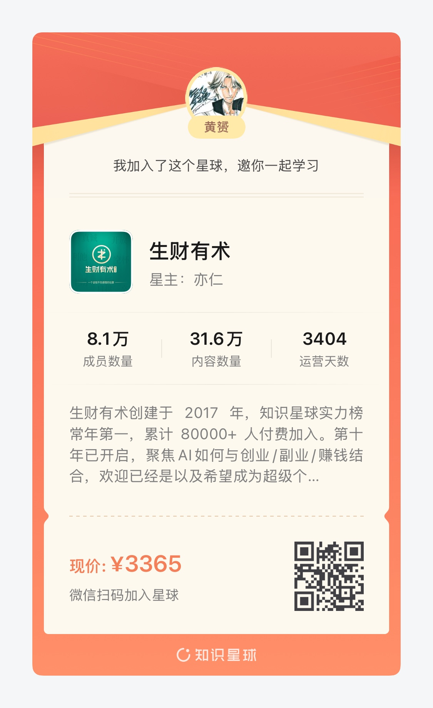

# 第六章 高阶变现（月入几万以上）：SaaS、出海、产品矩阵

到了这一档，问题的性质变了。入门级拼执行力，中阶拼产品和流量，高阶拼**系统**：一套能持续产出产品的方法论、一个能复利的资产组合、一种别人短期抄不走的壁垒。这一章拆三种被验证过的高阶形态，订阅制 SaaS、产品矩阵、B 端大单，以及它们背后共同的算术。

## 6.1 先算账：三种高阶商业模式的数学

一位从电商卖家转型全栈开发者的出海圈友，靠 AdSense 累计赚了十多万美金之后，把三种模式的账算得清清楚楚：

1. **广告模式（AdSense）**：粗略估算 100 万月访客对应约 1 万美金月收入，一年百万人民币左右。优点是变现几乎没有阻力，缺点是对流量规模要求极高。
2. **SaaS 订阅模式**：通过 Stripe/PayPal 收款，客单价和转化率决定利润。一百个访客就可能出一单，一单可能就是一百美金。同样的年收入，只需要几百个客户、几十万访客，流量要求比广告模式低一个数量级。
3. **2B 定制服务**：客单从几百到几万，AI 已经把建站的边际成本压到接近零（他的原话：一个月 20 美元的 Claude 可以做一百个网站），瓶颈不在生产，在销售。

他的选择也很说明问题：赚够了广告钱之后，2025 年重点转向 SaaS，一边上站做产品，一边用 AI 做矩阵自媒体获取社媒流量。**广告模式是流量生意，SaaS 是转化生意，2B 是销售生意**。高阶玩家的共同点是清楚自己在做哪种生意，并且知道什么时候该切换。

## 6.2 SaaS：小场景，深挖掘，慢生意

SaaS 的高阶案例，最值得反复研究的还是 stagetimer.io：一个远程控制倒计时器，只服务"线下活动舞台计时"这一个场景，产品名就是场景名。功能全部围绕场景深挖，创建房间、设置嘉宾出场顺序、分享链接任意设备打开即显示、管理员调整实时同步。免费套餐获客，付费套餐 24/48 欧元两档。四年做到月访问 20 万、MRR 1.5 万美元。

从它身上能提炼三条 SaaS 纪律：

- **垂直到不能再垂直。**"倒计时器"是红海，"舞台倒计时器"是蓝海。场景越具体，用户搜到你的意图越精准，付费转化越高，大公司越懒得跟你抢。
- **定价对准 B 端场景**。个人用户不会为倒计时付 24 欧一个月，活动公司会。这是 6.1 节那道数学题的现实版：几百个 B 端客户就足够撑起一个体面的 MRR。
- **接受慢**。前两年几乎没起色，流量 2023 年初才起飞。订阅生意的复利在后半段，前半段全是投入。第二章的心理建设，到这一档还在考试。

从中阶升上来的读者，SaaS 最平滑的入口是第五章末尾说的那个信号：同一批用户反复向你要更多功能。把单点工具的高级功能拆出来做订阅墙，就是最小可行的 SaaS。

## 6.3 产品矩阵：把一次成功复制十次

单产品的天花板取决于那个需求本身的大小，矩阵的天花板取决于你的方法论能复制多少次。社群里有一份小程序矩阵的复盘，把这条路的节奏讲得极其真实。

作者的核心动作：某个小程序跑通后，深入复盘它为什么成，把成功原因提炼成可复制的方法论，再套用到下一个。最终 7 个小程序稳定产出，10 个月企业结算收入 5~9 万，加上个人收款约 10 万。

更值钱的是他画出的收益曲线四阶段，几乎适用于所有矩阵型生意：

1. **前 1~3 个月**：月入几百，日收入几块钱。最煎熬，但最关键。你在这段时间里打磨的是方法论，不是收入。
2. **3~6 个月**：月入几千，2~3 个产品在跑，开发速度明显变快。
3. **6~12 个月**：月入破万，5 个以上产品稳定产出，做一个新的只要 1~2 天。
4. **12 个月以后**：存量产品基本不需维护，时间全部花在做新产品上。

注意这条曲线的本质：**单个产品的开发时间在递减，收益在叠加**。这就是矩阵和"连续做单品"的区别，后者每次从零开始，前者每次都站在上一次的肩膀上。

出海站群是同一个逻辑的另一个皮肤。月入 4 万刀的小耳朵、追新词的站长，路径都是"多上站、多做产品，量变引发质变，不停学习榜单上的赚钱产品"。但矩阵有个前置条件容易被忽略：**先有一次真正跑通的单品，再谈矩阵**。小耳朵出海前三个多月上线了 10 个网站，一分钱没赚到，其中一个多月还栽在完美主义上（那个叫 italian brainrot 的新词产品，总想做出完美交互，最后压根没上线）。直到第 4 个月做出第一个有正反馈的网站，矩阵才开始有意义。**用十个平庸的复制品堆不出一个成功，矩阵复制的必须是被验证的成功。**

## 6.4 B 端大单：技术人天花板最高的一条路

C 端产品的收入上限是流量乘以转化，B 端服务的收入上限是你敢不敢报价。各类社群里最极端的样本：一位创业八年的软件公司创始人孟虎，靠 AI + OpenClaw 给企业做全链路自动化，签单做到千万级。

他的方法论拆开看，每一步都是前面章节讲过的东西的 B 端放大版：

- **获客三条路径**：内容分享（第十一章的 IP 打法）、产品工具开发（用工具当敲门砖）、渠道体系建设。
- **交付结构**：用 AI + Agent 串联业务全链路，触发条件 → AI 处理 → 结果输出 → 人工复核，打通 CRM、企业微信、飞书、钉钉这些数据孤岛。
- **三条避坑铁律**：别贪大求全，先从一个高频重复场景切入；提前定好数据安全红线；工具选型不选最贵的，选最适配业务流程的。

B 端的门槛不在技术在信任，所以它的正确起点往往是第四章那个"免费诊断"和第三章那套访谈方法：先用小项目进场，交付超预期，再顺着企业内部的推荐往大单爬。一个技术人从月入几万的 C 端产品切到 B 端服务，收入弹性会突然打开。C 端你很难把客单价从 10 美元提到 10 万美元，B 端这只是从"帮一个部门"到"帮一家集团"的距离。

## 6.5 高阶阶段的自检清单

- 我能一句话说清自己在做流量生意、转化生意还是销售生意吗？
- 我的收入里，有多少来自"系统在运转"，多少仍来自"我在干活"？
- 我有没有一次被完整验证的成功，值得开始复制？（没有就回中阶继续打磨单品）
- 复制的边际成本在下降吗？（第 N 个产品的开发时间应该显著短于第 1 个）
- 如果做 B 端：我有没有可展示的成果、可复用的交付 SOP、明确的数据安全边界？

高阶不是终点站，是换了一种玩法的起点。支撑这种玩法的技术选型、流量系统、定价体系和杠杆结构，接下来几章逐个拆。下一章先回答一个程序员最容易问反的问题：每个阶段到底该会什么技术，以及更重要的，不该学什么。

---

## 推荐《生财有术》

生财有术有着一群爱拼爱整活的圈友，他们在各个平台上都努力着赚钱。小红书，抖音，B站，知乎，微信生态圈，Reddit, X，TikTok, 等等。在这个圈子里，能看到所有不上班却还能养活自己的机会。本手册案例绝大部分都来自这里，推荐你也加入。

---

## 推荐《AI小生意案例库》

这是我整理互联网小生意案例的地方，绝大多数案例均使用AI，搭配1-2个人可以完成。我相信当我们看的足够多，尝试得足够多，就有机会积累自己的IP资产，为下个产品拉大成功的概率。

